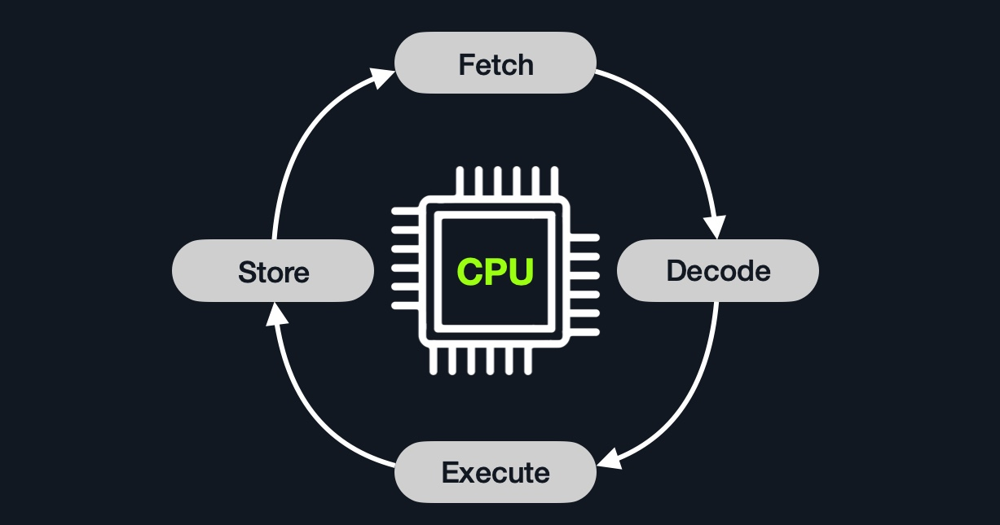

# CPU 명령어 사이클 & 클럭 사이클 요약 정리

## CPU 구조 개요
- **CPU (중앙 처리 장치)**: 컴퓨터의 핵심 처리 유닛이며, 다음을 포함함:
  - **CU (제어 장치)**: 데이터 흐름 제어
  - **ALU (산술 논리 장치)**: 연산 및 논리 계산 수행

## 클럭 속도 & 클럭 사이클 (Clock Speed & Clock Cycle)
- CPU는 내부 클럭 신호를 기준으로 작동함 → "틱"마다 명령어 일부 수행
- **1GHz** = 초당 10억 번 클럭 사이클
- 각 사이클은 **Fetch, Decode, Execute, Store** 중 하나의 단계를 처리


## 명령어 사이클 (Instruction Cycle)
- CPU가 하나의 명령어를 처리하는 전체 과정을 말함

### 4단계로 구성
| 단계 | 설명 |
|------|------|
| Fetch | 다음 명령어의 주소를 Instruction Address Register(IAR)에서 가져옴 |
| Decode | 이진수 명령어를 해석하여 어떤 연산인지 파악 |
| Execute | 연산 실행 (ALU 사용) |
| Store | 결과 값을 목적지에 저장 |

> 대부분 CU가 수행하지만, 산술 연산은 ALU가 담당



## 명령어 파이프라인 (Instruction Pipelining)
- 고전 CPU는 명령어를 순차적으로 처리했지만,
- **현대 CPU는 병렬 처리** → 여러 명령어 사이클이 동시에 작동함


> 각 단계는 독립적으로 다음 명령어를 동시에 처리 가능 → 속도 향상


---

## ISA (Instruction Set Architecture)
- CPU마다 이해할 수 있는 명령어 세트가 다름
- 예: 같은 바이너리 코드를 Intel CPU와 ARM CPU는 다르게 해석함

| 구조 | 설명 |
|------|------|
| RISC | 단순 명령어 기반, 더 많은 사이클 필요하지만 빠름 & 저전력 |
| CISC | 복잡한 명령어 기반, 적은 사이클로 처리하지만 고전력 & 느림 |

---

## 어셈블리 명령어 예시

```asm
add rax, 1
```
- Fetch: rip에서 "add rax, 1" 가져오기
- Decode: 명령어 해석 (48 83 C0 01)
- Execute: ALU로 rax + 1 수행
- Store: rax에 결과 저장

---

## 참고 명령어
```bash
$ lscpu      # CPU 아키텍처 확인
$ uname -m   # x86_64인지 확인
```

---

## 요약
- CPU는 클럭에 따라 명령어 사이클을 반복 수행
- 각 명령어는 4단계 (Fetch → Decode → Execute → Store)로 실행됨
- 현대 CPU는 병렬 처리로 성능 극대화
- CPU마다 다른 ISA 사용 (Intel = x86_64, ARM 등)


