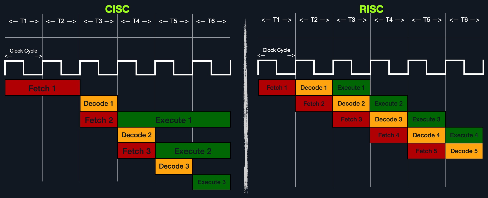

# CISC vs RISC 구조 정리

## Instruction Set Architecture (ISA)란?

- 컴퓨터의 **어셈블리 언어 문법과 의미**를 정하는 설계 구조
- ISA는 프로세서가 **어떤 명령어를 어떻게 해석하고 실행할지** 정의함

### 주요 구성 요소

| 요소 | 설명 | 예시 |
|------|------|------|
| Instructions | 실행할 명령어 | `add rax, 1`, `mov rsp, rax` |
| Registers | 명령어 실행에 사용되는 초고속 저장소 | `rax`, `rsp`, `rip` |
| Memory Addresses | 명령어가 읽고 쓰는 주소 | `0x44d0`, `$rax` |
| Data Types | 저장되는 데이터의 크기 | byte, word, dword |

ISA는 운영체제, 어셈블리, 해킹 실습에서 가장 기본이 되는 핵심 개념이다.

### 실행 흐름
- 1. Instruction를 Fetch (명령어 읽기)
- 2. Decode 단계에서 어떤 레지스터(Registers)를 쓸지 판단
- 3. 메모리 주소(Memory Address)를 통해 RAM 또는 레지스터에서 데이터 접근
- 4. 데이터 크기(Data Type)에 따라 연산 및 저장 방식 결정
- 5. ALU 또는 CU가 명령 실행 (Execute), 결과 저장 (Store)
 


---

## CISC (Complex Instruction Set Computer)

- 인텔, AMD CPU에서 사용되는 구조 (대부분의 서버, PC)
- **복잡한 명령어**를 CPU가 직접 실행함 → **명령 수는 적지만 실행은 무겁다**

### 특징
| 항목 | 설명 |
|------|------|
| 명령어 | 복잡하고 다양한 종류 지원 (~1500개 이상) |
| 명령어 길이 | 가변 (8비트 단위로 늘어남) |
| 실행 시간 | 명령어마다 다름 (여러 클럭 사이클 소요) |
| 최적화 | 하드웨어(CPU 내부)에서 처리 |
| 코드 길이 | 짧은 편 (명령이 복잡하니까) |
| 소비 전력 | 높음 |

### 예시
```asm
add rax, rbx  ; 두 레지스터를 더하는 명령어 하나로 연산 완료
```

---

## RISC (Reduced Instruction Set Computer)

- ARM, Apple 칩 등 모바일/저전력 장치에서 사용됨
- **단순하고 빠른 명령어**를 조합해 복잡한 작업 수행

### 특징
| 항목 | 설명 |
|------|------|
| 명령어 | 단순하고 적은 수 (~200개) |
| 명령어 길이 | 고정 (32bit 또는 64bit) |
| 실행 시간 | 각 명령어가 1 클럭 사이클로 실행됨 |
| 최적화 | 소프트웨어(컴파일러, 어셈블리)가 담당 |
| 코드 길이 | 길어짐 (많은 단순 명령어 조합 필요) |
| 소비 전력 | 매우 낮음 (모바일 최적) |

### 예시
```asm
load r2
load r3
add r1, r2, r3  ; 단순 명령어 여러 개로 구성
```

---

## CISC vs RISC 비교 요약표

| 항목 | CISC | RISC |
|------|------|------|
| 복잡성 | 복잡함 | 단순함 |
| 명령어 길이 | 가변 | 고정 |
| 명령어 수 | 많음 (~1500) | 적음 (~200) |
| 실행 속도 | 느림 (다단계) | 빠름 (1사이클) |
| 최적화 방식 | 하드웨어 중심 | 소프트웨어 중심 |
| 코드 길이 | 짧음 | 길음 |
| 전력 소비 | 높음 | 낮음 |
| 대표 사례 | Intel, AMD | ARM, Apple |

---

## 클럭 사이클 비교




### 이미지 설명
- **CISC**: 한 명령어가 여러 클럭 주기를 소비함
- **RISC**: 각 명령어가 하나의 클럭 주기만 사용하므로 병렬 처리에 유리함

> 따라서 고속 처리, 저전력 환경에서는 RISC가 강점  
> 복잡한 기능을 줄여 코드 양을 줄이고 싶은 경우에는 CISC가 유리함

---

## 요약

- 시스템 해킹을 제대로 하려면 **CISC 아키텍처에 대한 깊은 이해**가 필수고,  
- RISC 구조를 병행 학습하면 ARM 기반의 모든 플랫폼까지 해킹/리버싱을 확장할 수 있다.


