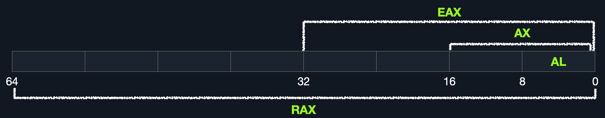

# Registers, Addresses, and Data Types

## 📂 개요

어셈블리를 배우기 전 반드시 이해해야 할 기본 요소들입니다:

- 레지스터(Registers)
- 메모리 주소(Memory Addresses)
- 주소 저장 방식(Endianness)
- 데이터 유형(Data Types)

---

## 📊 Registers (레지스터)

- CPU 내부에 있는 가장 빠른 저장 장치이며, 연산에 필요한 데이터를 임시로 저장함
- 각 CPU 코어마다 존재하며, 처리 속도를 높이기 위해 사용됨

### 주요 레지스터 종류

| 구분       | 이름                                    | 설명                         |
| -------- | ------------------------------------- | -------------------------- |
| 데이터 레지스터 | rax, rbx, rcx, rdx, rdi, rsi, r8~r10 | 연산, 시스템 호출 인자 등 사용         |
| 포인터 레지스터 | rbp, rsp, rip                         | 스택 시작 위치, 현재 위치, 명령어 주소 저장 |

### 서브 레지스터 (하위 비트 접근)

| 비트 크기  | 이름 (rax 기준) |
| ------ | ----------- |
| 64-bit | rax         |
| 32-bit | eax         |
| 16-bit | ax          |
| 8-bit  | al          |

※ eax는 rax의 하위 32비트, ax는 하위 16비트, al은 하위 8비트를 의미


_Image from Hack The Box Academy (https://academy.hackthebox.com)_

---

## 📁 Memory Addresses (메모리 주소)

- x86_64 시스템에서 사용할 수 있는 주소 범위는 0x0 ~ 0xffffffffffffffff
- 메모리는 여러 영역(Stack, Heap, Text, Data 등)으로 나뉨

### 주소 지정 방식 (Addressing Modes)

| 방식        | 설명                 | 예시            |
| --------- | ------------------ | ------------- |
| Immediate | 명령어 내부에 값이 직접 포함됨  | add 2         |
| Register  | 레지스터가 값을 가지고 있음    | add rax       |
| Direct    | 명령어에 직접 주소가 지정됨    | call 0x44d0ff |
| Indirect  | 레지스터나 포인터가 주소를 참조함 | call [rax]    |
| Stack     | 스택의 주소를 사용함        | add rsp       |

> 주소를 어떻게 가져오는지 이해하는 것은 버퍼 오버플로우, ROP 등의 익스플로잇에 매우 중요

---

## ↕ Endianness (엔디안)

- 바이트를 메모리에 저장하는 순서를 의미함
- **Little Endian (Intel/AMD)**: 가장 낮은 바이트가 먼저 저장됨 (우→좌)
- **Big Endian**: 가장 높은 바이트가 먼저 저장됨 (좌→우)

### 예시

```
값: 0x0011223344556677
Little Endian 저장: 0x7766554433221100
Big Endian 저장:    0x0011223344556677
```

> 어셈블리에서 문자열이나 주소를 푸시할 때는 역순으로 저장해야 함

---

## ↓ Data Types (데이터 타입)

명령어마다 사용하는 데이터의 크기가 다르며, 레지스터와 타입이 맞아야 함

| 타입    | 크기                | 예시                 |
| ----- | ----------------- | ------------------ |
| byte  | 8 bits (1 byte)   | 0xab               |
| word  | 16 bits (2 bytes) | 0xabcd             |
| dword | 32 bits (4 bytes) | 0xabcdef12         |
| qword | 64 bits (8 bytes) | 0xabcdef1234567890 |

### 레지스터별 적절한 데이터 타입

| 레지스터 | 데이터 타입 |
| ---- | ------ |
| al   | byte   |
| ax   | word   |
| eax  | dword  |
| rax  | qword  |

※ 크기가 맞지 않으면 오류 발생 또는 예상과 다른 결과가 나올 수 있음

---

## ✅ 요약 정리

- **Registers**: CPU 내부 연산용 저장 공간
- **Memory Addresses**: 데이터가 저장된 위치 주소
- **Endianness**: 데이터를 메모리에 저장하는 순서
- **Data Types**: 사용할 수 있는 데이터 크기

> 어셈블리 기초를 정확히 이해하는 것이 시스템 해킹과 익스플로잇 분석의 핵심입니다.

> 📌 참고 출처: Hack The Box Academy (https://academy.hackthebox.com)
